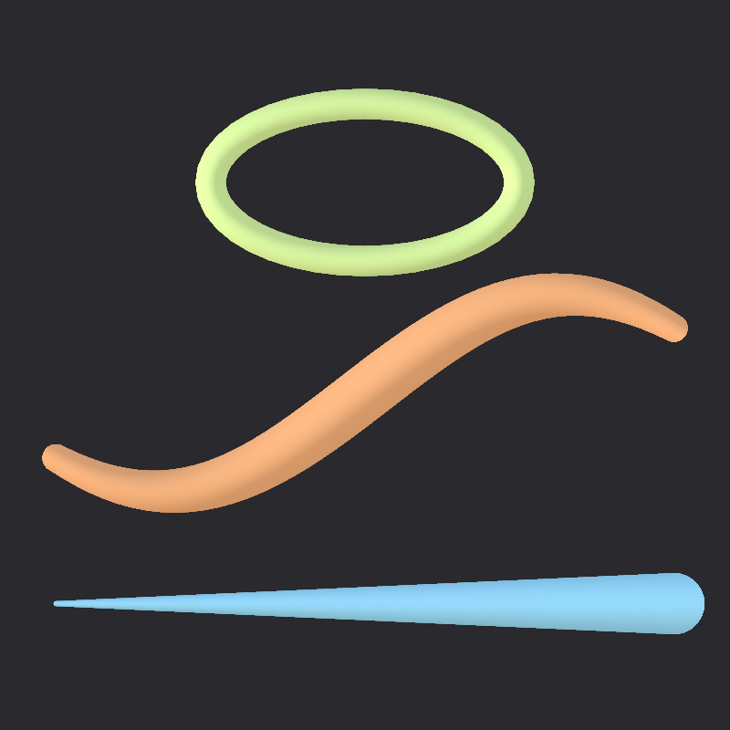

# Grease Pencil to Unity

Export Blender 5 Grease Pencil objects to Unity 6 and keep the look: the curve
points, the radius around each one, and the colour. A URP shader rebuilds each
stroke as a camera-facing ribbon and bends its normal across the width so it
shades like a tube — the "puffed" 3D look — without casting shadows.

Animation exports either as the layers' own Grease Pencil keyframes or as a full
per-frame bake that captures modifiers, armatures and drivers.

| Blender | Unity, flat | Unity, puffed |
|---|---|---|
|  |  |  |

The first two are the same frame rendered in each application. Colours match
exactly; the remaining difference is antialiasing along stroke edges.

| | |
|---|---|
| Blender | 5.0+ (Grease Pencil v3) |
| Unity | 6000.0+ with the Universal Render Pipeline |

## Install

**Blender.** Build the extension and install the zip:

```bash
python blender/build_extension.py
```

*(if you are not skilled with computers, just download build from the `blender` folder)*


Then in Blender: Edit ▸ Preferences ▸ Get Extensions ▸ ⌄ ▸ Install from Disk,
and pick `dist/grease_pencil_to_unity-0.1.0.zip`.

**Unity.** Window ▸ Package Manager ▸ + ▸ Install package from disk, and pick
`unity/com.greasepencil.tounity/package.json`. Or add it to the project's
`Packages/manifest.json`:

```json
"com.greasepencil.tounity": "file:../../path/to/unity/com.greasepencil.tounity"
```

## Exporting

Select one or more Grease Pencil objects, then either use the **GP Export** tab
in the 3D viewport sidebar (`N`) or File ▸ Export ▸ Grease Pencil for Unity.
The options live in the file browser's sidebar.

| Option | What it does |
|---|---|
| **Selected Only** | Export the selection rather than every Grease Pencil object in the scene. Several objects become one file each. |
| **Fills** | Also triangulate strokes whose material has Show Fill. |
| **Hidden Layers** | Include layers hidden in the layer list; they arrive as inactive GameObjects. |
| **Apply Modifiers** | Export the evaluated result. Needed for noise, armature deformation, geometry nodes — anything that changes the drawing at render time. |
| **Animation: None** | Current frame only. |
| **Animation: Keyframes** | Only the frames where a layer's drawing actually changes. Small files, exact for hand-drawn animation. |
| **Animation: Bake** | Every frame in the range, so deformation is captured. Identical drawings are deduplicated, so a 60-frame hold still costs one drawing. |
| **Step** | Sample every Nth frame when baking — the way to export on twos. |
| **Debug Manifest** | Also write the manifest next to the export as readable JSON. |

## Importing

Drop the `.gpencil` into the Unity project. The importer produces a GameObject
with one child per layer, the meshes, the materials and an AnimationClip, all as
sub-assets you can re-import without going back to Blender.

| Setting | What it does |
|---|---|
| **Scale Factor** | Multiplies positions. Blender units map 1:1 by default. |
| **Width Scale** | Multiplies every stroke radius. |
| **Puff** | How far the normal bends across the ribbon. `0` shades flat, `1` shades like a full tube cross-section. |
| **Light Influence** | `0` reproduces Blender's colours exactly; `1` lights the strokes with the scene. Layers with **Use Lights** off in Blender stay flat regardless. |
| **Screen Space Width** | Keep apparent thickness constant with distance instead of shrinking. |
| **Sort Mode** | `From Blender` follows the object's Stroke Depth Order. `2D` stacks layers back to front with no depth writes. `3D` alpha-clips and writes depth, so strokes intersect scene geometry. |
| **Playback** | `Runtime Component` adds a `GreasePencilPlayer` that plays on its own; its `Frame` property can still be driven by an Animator or Timeline. `Mesh Swap Curves` puts object-reference curves on each layer's MeshFilter instead, with no runtime component. |

Strokes never cast shadows: there is no ShadowCaster pass in the shader, and the
importer sets every renderer to `ShadowCastingMode.Off`.

### Matching Blender exactly

Set **Light Influence** to `0`. Colours are exported linear and stored as
float32 vertex colours, so in a **Linear** colour space project (Edit ▸ Project
Settings ▸ Player ▸ Color Space — the normal setting for URP) they land on
exactly the values Blender has. In a Gamma project the importer encodes them to
sRGB instead, so the result still matches.

One thing worth knowing about the Blender side: if a layer has **Use Lights**
on — the default — EEVEE lights Grease Pencil like any other surface, so a
render with no lamps in the scene comes out much darker than the material
colours. The exporter writes the flat colours, the ones the viewport shows.
Unity's **Light Influence** is what reproduces the lit case, and layers with
Use Lights off in Blender stay flat there too.

## How it works

Nothing is converted to curves or meshes inside Blender. The add-on reads the
drawing attributes straight out of Grease Pencil — `position`, `radius`,
`opacity`, `vertex_color`, `cyclic`, `material_index` and the rest — folds the
material colour, per-point vertex colour, opacity and layer tint into one RGBA
per point, and writes it all to a compact binary `.gpencil` file.

Unity's importer builds a mesh holding only the **centreline**: two vertices per
curve point. The shader pushes them apart sideways, towards the camera, by the
point's radius. That is how Blender draws Grease Pencil, so the strokes look
right from any angle, keep their width when you orbit, and the meshes stay
small enough to swap per frame.

```
Blender                          .gpencil                    Unity
-------                          --------                    -----
layer -> frame -> drawing        manifest (JSON)             root GameObject
  position, radius, opacity  ->  + binary blob           ->    one child per layer
  vertex_color, material                                       ribbon mesh per drawing
  fills, caps, blend mode                                      URP material per layer
  object transform                                             AnimationClip
```

## Known limits

- Stroke and fill textures are not exported; materials come across as solid
  colour. Gradient fills use their base colour.
- Layer blend modes map to fixed-function blending. Regular, Add, Subtract and
  Multiply work; Hardlight and Divide fall back to Regular with a warning.
- Draw order within a layer is grouped by material rather than kept strictly
  per stroke. That matches how Grease Pencil art is usually built, but strokes
  that interleave two materials and overlap can sort differently than in Blender.
- Sharp corners are not mitred, so a hard direction change pinches the ribbon
  slightly. Grease Pencil strokes are dense enough that this rarely shows.
- Layer masks, onion skinning and per-layer transforms other than the object's
  are not applied.

## Licence

MIT — see [LICENSE](LICENSE).
